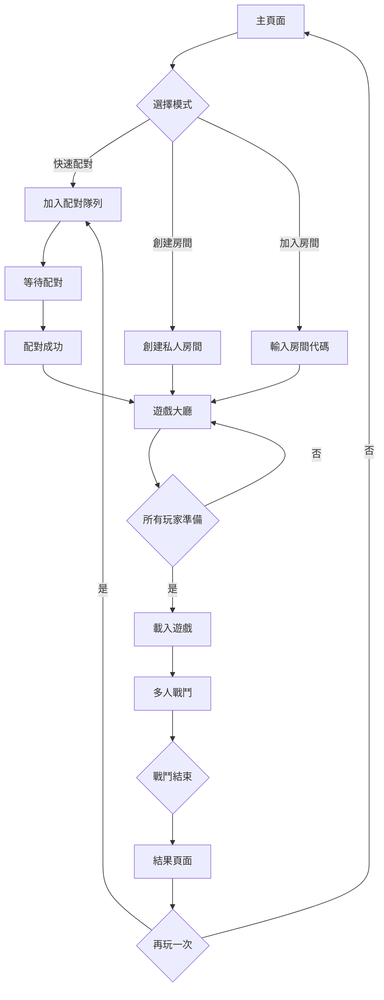
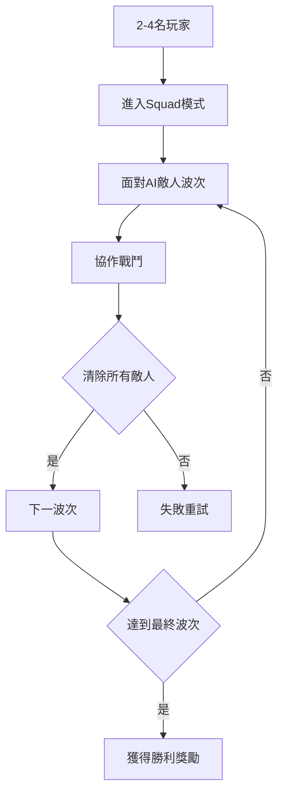
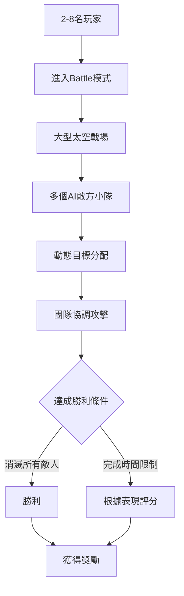
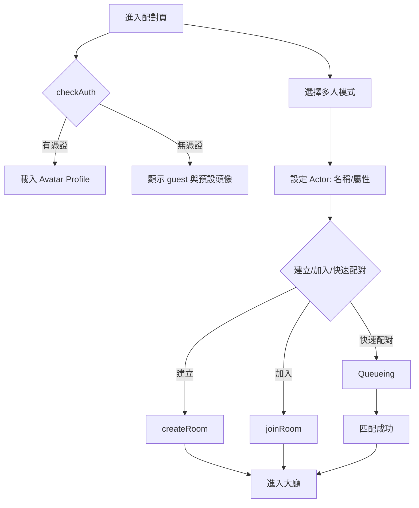
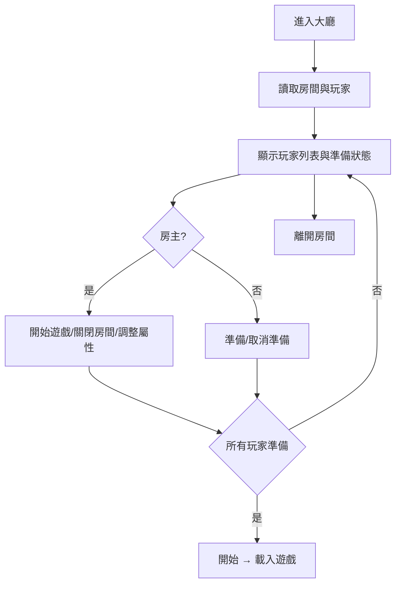

# Space Pirates 多人遊戲產品需求文檔

## 1. 產品概述
將現有的單人Space Pirates遊戲轉變為支援多人PvE合作的線上遊戲。玩家可以組隊進行太空戰鬥，共同對抗AI敵人，體驗協作戰鬥的樂趣。

- **目標用戶**：喜歡太空射擊遊戲和合作遊戲的玩家
- **核心價值**：提供流暢的多人太空戰鬥體驗，保持原有單人模式的完整性
- **市場定位**：休閒到中等核心度的多人合作遊戲

## 2. 核心功能

### 2.1 用戶角色
| 角色 | 註冊方式 | 核心權限 |
|------|----------|----------|
| 訪客玩家 | 無需註冊 | 可以遊玩單人模式，加入多人遊戲但無進度保存 |
| 註冊玩家 | 郵箱註冊 | 可以保存遊戲進度，查看統計數據，參與排行榜 |
| VIP玩家 | 付費升級 | 優先配對，專屬遊戲模式，詳細統計分析 |

### 2.2 功能模組
多人Space Pirates包含以下主要頁面：
1. **主頁面**：遊戲模式選擇，快速配對，登入/註冊入口
2. **配對頁面**：等待配對，配對進度，取消配對
3. **遊戲大廳**：房間設置，玩家列表，準備狀態
4. **多人遊戲頁面**：戰鬥畫面，隊友狀態，共享HUD
5. **結果頁面**：戰鬥統計，個人表現，隊伍成就

### 2.3 頁面詳情
| 頁面名稱 | 模組名稱 | 功能描述 |
|----------|----------|----------|
| 主頁面 | 遊戲模式選擇 | 顯示單人模式、多人Squad、多人Battle選項 |
| 主頁面 | 快速配對按鈕 | 一鍵開始配對，自動選擇最適合的遊戲模式 |
| 主頁面 | 玩家狀態 | 顯示當前登入狀態，等級，統計數據摘要 |
| 配對頁面 | 配對進度條 | 顯示當前排隊位置和預計等待時間 |
| 配對頁面 | 取消按鈕 | 允許玩家取消當前配對 |
| 配對頁面 | 匹配成功提示 | 顯示找到隊友和進入房間的動畫 |
| 遊戲大廳 | 房間設置 | 允許房主調整遊戲參數，難度，最大玩家數 |
| 遊戲大廳 | 玩家列表 | 顯示所有房間內玩家，準備狀態，等級 |
| 遊戲大廳 | 聊天功能 | 基本的文字聊天，預設快捷語句 |
| 多人遊戲頁面 | 共享戰鬥畫面 | 與單人模式相同的Babylon.js 3D渲染 |
| 多人遊戲頁面 | 隊友狀態面板 | 顯示隊友生命值，位置，主要武器狀態 |
| 多人遊戲頁面 | 共享目標系統 | 標記共享敵人，顯示隊友目標 |
| 結果頁面 | 個人統計 | 擊殺數，準確率，承受傷害，輸出傷害 |
| 結果頁面 | 隊伍成就 | 總擊殺數，完成時間，特殊成就 |
| 結果頁面 | 再玩一次 | 快速重新配對或返回房間的選項 |

## 3. 核心流程

### 3.1 多人遊戲流程

### 3.2 Squad PvE模式流程

### 3.3 Battle PvE模式流程

## 4. 用戶介面設計

### 4.1 設計風格
- **主色調**: 保持現有的太空主題深色背景
- **強調色**: 橙色 (#FF6B35) 用於重要按鈕和提示
- **輔助色**: 藍色 (#4A90E2) 用於隊友相關元素
- **字體**: 使用現有的未來科技感字體
- **按鈕**: 保持現有的3D立體風格
- **佈局**: 卡片式設計，保持與現有UI一致

### 4.2 頁面設計概覽
| 頁面名稱 | 模組名稱 | UI元素 |
|----------|----------|----------|
| 主頁面 | 遊戲模式選擇 | 三個並排的3D卡片，每個模式有獨特圖標和簡短描述 |
| 主頁面 | 快速配對按鈕 | 大型的橙色3D按鈕，帶有脈衝動畫效果 |
| 配對頁面 | 配對進度條 | 太空主題的進度條，帶有流動的星塵效果 |
| 遊戲大廳 | 玩家列表 | 頭像圓形顯示，準備狀態用綠色勾號標記 |
| 多人遊戲 | 隊友狀態 | 半透明HUD面板，顯示在畫面右側，不干擾主視野 |
| 結果頁面 | 統計展示 | 太空船控制面板風格的數據展示 |

### 4.3 響應式設計
- **桌面優先**: 主要針對桌面電腦優化
- **移動適配**: 支援平板電腦，但手機僅提供基本功能
- **觸控優化**: 支援觸控操作的虛擬搖桿和按鈕

## 5. 技術需求

### 5.1 網路需求
- **最低延遲**: 100ms以下為佳，200ms為可接受上限
- **頻寬需求**: 每個玩家上行/下行各64kbps
- **斷線處理**: 5秒內斷線重連保持遊戲狀態

### 5.2 性能需求
- **幀率**: 保持60fps，最低30fps
- **載入時間**: 進入戰鬥不超過10秒
- **記憶體**: 瀏覽器端不超過2GB

### 5.3 兼容性需求
- **瀏覽器**: Chrome 90+, Firefox 88+, Safari 14+
- **WebGL**: 支援WebGL 2.0
- **WebSocket**: 支援原生WebSocket

## 6. 商業模式

### 6.1 免費功能
- 單人模式完整體驗
- 基礎多人PvE模式
- 基礎統計和成就

### 6.2 付費功能
- VIP優先配對
- 高級遊戲模式
- 詳細統計分析
- 自定義房間設置
- 專屬外觀和特效

## 7. 配對頁面原型與交互草稿

### 7.1 版面布局（沿用既有風格）
- 頂端狀態列：顯示玩家名稱與圓形頭像；未登入顯示 `guest` 與預設頭像（主頁面 | 玩家狀態：m:\Project\SpacePirates\.trae\documents\multiplayer_product_requirements.md:32）。
- 模式卡片：遠端雙人優先；沿用既有3D卡片視覺（見 4.2 UI 概覽）。
- 配對面板：星塵進度條、隊列位置、預估等待時間；建立/加入房間與取消配對操作。
- 輔助提示：成功找到隊友動畫、錯誤/超時提示條。

### 7.2 狀態與事件
- 狀態：`idle`、`selecting`、`settingActor`、`queueing`、`matched`、`error`。
- 事件：`selectMode(mode)`、`setActor(payload)`、`createRoom(cfg)`、`joinRoom(roomId)`、`cancelQueue()`、`onMatched(room)`、`onError(message)`。

### 7.3 主要流程

### 7.4 邊界與回饋
- `取消配對`：立即回到 `idle`，保留已設定 Actor。
- `超時/錯誤`：非侵入式提示條；保留輸入與狀態；提供重試入口。
- `房間滿員`：禁用加入並引導至可用房間列表。

### 7.5 驗收標準
- 可建立/加入/取消配對，進度與狀態正確顯示。
- 頭像圓形一致；未登入顯示 `guest` 與預設頭像。
- 無重導登入；整體視覺與既有風格一致。

## 8. 遊戲大廳原型與交互草稿

### 8.1 版面布局（沿用既有風格）
- 房間標頭：房名、模式（team）、人數上/下限、公開狀態、房主標記（見 2.3 房間設置）。
- 玩家列表：圓形頭像卡片、名稱、準備狀態綠色勾號、屬性標籤（見 4.2 UI 概覽）。
- 準備面板：`準備/取消準備` 切換；房主 `開始遊戲`；提供 `離開房間`。
- 房間控制（房主）：`關閉房間`、調整 `properties`（難度等）。

### 8.2 狀態與事件
- 狀態：`loading`、`readyPartial`、`readyAll`、`starting`、`leaving`。
- 事件：`actorJoined(actor)`、`actorLeft(id)`、`readyStateChanged(playerId, ready)`、`startGame()`、`closeRoom()`、`leaveRoom()`、`roomUpdated(props)`。

### 8.3 主要流程

### 8.4 邊界與回饋
- 房主離開：依SDK能力轉移房主或關閉房間；UI明確提示。
- 房間滿員：禁用加入並提示；提供 `getAvailableRooms()` 引導。
- 斷線重連：保留最近房間資訊與重入入口；超時返回配對頁。

### 8.5 驗收標準
- 玩家列表與準備機制正確，房主控制權限清晰。
- 頭像圓形統一；視覺與交互對齊既有風格。
- 可從大廳開始一局並切換到多人戰鬥頁面。

## 9. PRD 總覽與目標

- 目標：在沿用現有 UI 設計風格的前提下，完整交付多人模式（遠端雙人）所需的登入、頭像、配對、連線、大廳、戰鬥與結果頁的 UX 與功能。
- 關鍵原則：禁止使用 redirect 登入；頭像圓形一致；未登入顯示 `guest` 與預設圖；配對與連線接入 VIVERSE SDK。
- 輸出：頁面規格、互動規範、介面契約摘要、驗收與里程碑。

## 10. 詳細功能需求

- 登入與玩家狀態
  - 初始化 `viverse.client({ clientId: "v48pybqy7f", domain: "account.htcvive.com" })`
  - `checkAuth()` 取得授權資訊；無授權則顯示 `guest`
  - 已登入透過 `getToken()` + Avatar SDK `getProfile()` 取得 `name` 與 `headIconUrl`
- 頭像顯示
  - 所有 2D 頭像圓形邊框；統一尺寸（40/64/96）；輕量陰影/光暈
  - 未登入顯示預設(default)圖像
- 玩家模式
  - 取消本地雙人模式
  - 遠端雙人沿用本地雙人玩法（輸入、武器、傷害、敵人波次）並加網路同步層
- 配對與連線
  - `playClient = new viverse.play()`；`matchmakingClient = await playClient.newMatchmakingClient("v48pybqy7f")`
  - `setActor({ session_id, name, properties })` → `createRoom` / `joinRoom` / `getAvailableRooms` / `getMyRoomActors` / `leaveRoom` / `closeRoom`

## 11. UI 設計風格準則（沿用現有）

- 字體：`magistral, sans-serif`；字重 `300/700`；黑色文字陰影 `(2,2)`
- 色彩：主文字/按鈕 `#a6fffa`、控件底色/邊框 `#688899`、滑桿主色 `#269ad4`、HUD 條色（血量/速度/冷卻）
- 資產：`menuButton.svg`、`spacePiratesLogo.svg`、`statsPanel.svg`、`textPanel*.svg`、`bottomBar*.svg`、`trackerIcon.svg`、`missileLockIcon.svg`
- 組件語言：3D按鈕、卡片式面板（九切）、深色太空主題、圓形控件（`Ellipse`）

## 12. 頁面規格

- 主頁
  - 玩家狀態：顯示登入狀態、名稱、圓形頭像；未登入為 `guest` 與預設頭像（`m:\Project\SpacePirates\.trae\documents\multiplayer_product_requirements.md:32`）
  - 模式卡片：遠端雙人優先；快速配對主按鈕（橙色 3D）
- 配對頁
  - StatusBar：名稱與圓形頭像；登入/guest 狀態
  - QueuePanel：星塵進度條、隊列位置、預估等待時間
  - RoomJoinForm：房間 ID 輸入檢查、Enter提交；錯誤提示非侵入式
  - 操作：建立/加入/取消配對；成功提示動畫
- 遊戲大廳
  - RoomHeader：房名、模式、人數上/下限、公開狀態、房主標記
  - PlayerList：圓形頭像卡片、名稱、準備綠勾、屬性標籤；加入/離開過渡動畫
  - RoomControls：房主 `開始遊戲/關閉房間`；所有玩家 `離開房間`；權限提示
- 多人戰鬥頁
  - 沿用現有 HUD 與共享目標系統；隊友狀態面板
- 結果頁
  - 個人統計與隊伍成就；`再玩一次` 返回配對頁；控制面板風格

## 13. 介面契約摘要（前端服務）

- AuthService：`initClient`、`checkAuth`、`getToken`、`getDisplayName`、`isGuest`
- AvatarService：`init`、`getProfile`、`getActiveAvatar`、`getPublicAvatarList`、`getAvatarFileWithSDK`、`getHeadIconUrlOrDefault`
- PlayService：`init`、`newMatchmakingClient`、`setActor`、`createRoom`、`joinRoom`、`leaveRoom`、`closeRoom`、`getAvailableRooms`、`getMyRoomActors`、`on`
- UI 模型：`UserProfile`、`Actor`、`Room`、`PlayerUI`

## 14. 非功能需求

- 效能：60fps 目標（最低 30fps）；載入戰鬥 ≤10s
- 網路：延遲 ≤100ms（可接受 ≤200ms）；斷線重連 5s 內恢復
- 相容性：Chrome 90+、Firefox 88+、Safari 14+；WebGL 2.0

## 15. 邊界情境

- 憑證失效：降級為 `guest` 顯示；保留 UI 操作（可加入公開房）
- 房間滿員：禁用加入並引導 `getAvailableRooms()`
- 房主離開：若 SDK 支援則自動轉移；否則房間關閉並提示
- 斷線：提供重連入口；超時返回配對頁

## 16. 驗收標準

- 主頁正確顯示玩家狀態與圓形頭像；未登入顯示 `guest` 與預設頭像
- 配對頁可建立/加入/取消；隊列/時間資訊準確；錯誤回饋清晰
- 大廳列表與準備機制即時更新；房主權限操作清楚；可開始遊戲
- 遠端雙人可完整打完一局並展示結果；全流程於 viverse.com 正常運作

## 17. 里程碑（Milestones）

- M1：PRD 與 UI 規格定稿（1 週）
  - 交付：本 PRD、介面契約摘要、配對/大廳原型草稿
- M2：Auth/Avatar 整合與主頁狀態（1 週）
  - 任務：`checkAuth`/`getToken`/`getProfile`；StatusBar 與圓形頭像；`guest` 顯示
  - 驗收：主頁準確顯示登入與頭像；無重導
- M3：配對頁與 Play SDK 對接（1–2 週）
  - 任務：`newMatchmakingClient`、`setActor`、`createRoom`/`joinRoom`、QueuePanel/RoomJoinForm；取消配對與錯誤回饋
  - 驗收：建立/加入/取消流程完整；進度資訊正確
- M4：大廳頁與準備機制（1–2 週）
  - 任務：PlayerList/RoomHeader/RoomControls；`getMyRoomActors`；房主開始遊戲
  - 驗收：列表與準備狀態即時更新；權限操作生效
- M5：遠端雙人 NetSync 整合（2 週）
  - 任務：輸入同步、狀態增量、預測/權威修正、斷線重連；沿用本地雙人玩法
  - 驗收：雙人一局流暢，性能達標；重連可恢復
- M6：結果頁與流程收斂（0.5 週）
  - 任務：個人/隊伍統計、再玩一次；樣式一致
- M7：viverse.com E2E 測試（1 週）
  - 任務：部署測試、修正授權與連線問題、邊界情境驗證
- M8：優化與發佈準備（0.5–1 週）
  - 任務：性能優化、錯誤處理完善、監控與日誌、最終驗收

## 18. 交付與測試

- 交付：PRD、頁面原型與組件標注、服務契約介面、測試計劃與驗收報告
- 測試：本地以 UI 假資料與 stub；正式於 viverse.com 進行端到端驗證

## 19. 頁面元件清單與尺寸/色彩/動效規格

### 19.1 主頁（玩家狀態/模式選擇/快速配對）
- StatusBar（玩家狀態）
  - 元件：`AvatarBadge(sm)`、`TextBlock(name)`、`TextBlock(status)`
  - 尺寸：頭像 `40px`；文字字重 `700`（標題）/`300`（狀態）
  - 色彩：文字 `#a6fffa`；陰影 `black` 偏移 `(2,2)`
  - 動效：載入淡入 `150ms`；hover 無需強調（資訊區）
- 模式卡片（ModeCard）
  - 元件：`Image(textPanel*.svg)` 背景、`Icon`、`TextBlock(title)`、`TextBlock(description)`
  - 尺寸：卡片 `360x220px`；圖標 `96px`；內邊距 `24px`
  - 色彩：文字 `#a6fffa`；卡片邊框與面板資產沿用 `textPanel` 九切
  - 動效：hover 放大 `1.03x` 與光暈 `120ms`；focus 邊框亮度提升
- 快速配對按鈕（Primary Button）
  - 元件：`Button.CreateImageButton(menuButton.svg)`、`TextBlock`
  - 尺寸：`280x64px`；字重 `700`
  - 色彩：文字常態 `#a6fffa`、hover `#ffffff`；背景 `menuButton.svg`
  - 動效：hover 漸變 `150ms`；click 壓下 `100ms` 回彈

### 19.2 配對頁（QueuePanel/RoomJoinForm/操作）
- 頂端狀態列（同主頁 StatusBar）
- QueuePanel（進度/隊列）
  - 元件：`Slider` 進度條、`TextBlock(estimatedWaitTime)`、`TextBlock(positionInQueue)`
  - 尺寸：進度條 `520x8px`；拇指圓形 `12px`
  - 色彩：主色 `#269ad4`、背景 `#688899`、文字 `#a6fffa`
  - 動效：進度平滑更新 `≤200ms`；成功匹配淡入提示 `150ms`
- RoomJoinForm（房間ID）
  - 元件：`InputText`、`TextBlock(error)`、`Button(join)`
  - 尺寸：輸入框 `360x48px`；字重 `300`
  - 色彩：邊框 `#688899`；focus 光暈 `#a6fffa`；錯誤文字 `#af2d0e`
  - 動效：focus 光暈 `120ms`；錯誤提示淡入 `150ms`
- 操作按鈕（建立/取消）
  - 元件：`Button(menuButton.svg)`
  - 尺寸：`240x56px`
  - 色彩：同主按鈕；禁用狀態文字 `#688899`
  - 動效：hover `150ms`；禁用無動效

### 19.3 遊戲大廳（RoomHeader/PlayerList/RoomControls）
- RoomHeader（房間資訊）
  - 元件：`TextBlock(roomName)`、`Badge(mode)`、`TextBlock(players)`、`TextBlock(publicFlag)`、`Icon(master)`
  - 尺寸：標題字重 `700`；行高 `32px`
  - 色彩：文字 `#a6fffa`；徽章背景沿用 `textPanel` 視覺
  - 動效：資料更新數值漸變 `150ms`
- PlayerList（玩家卡片）
  - 元件：多個 `PlayerCard`（`AvatarBadge(md)`、`TextBlock(name)`、`Icon(ready)`、`Tag(attributes)`）
  - 尺寸：列表柵格 `3 列`（桌面）；卡片寬 `280px`；頭像 `64px`
  - 色彩：名稱 `#a6fffa`；準備勾號 `#05d000`
  - 動效：加入/離開淡入淡出 `150ms`；準備切換勾號彈跳 `120ms`
- ReadyToggle（準備）
  - 元件：`Button`、`Icon`
  - 尺寸：`220x56px`
  - 色彩：準備中背景更亮；文字 `#a6fffa`
  - 動效：切換壓下與回彈 `100ms`；狀態文字漸變 `120ms`
- RoomControls（房主控制/離開）
  - 元件：`Button(start)`、`Button(close)`、`Button(leave)`
  - 尺寸：開始 `280x64px`；關閉 `220x56px`；離開 `200x56px`
  - 色彩：主操作強調；禁用狀態灰度 `#688899`
  - 動效：hover `150ms`；禁用無動效；錯誤提示條 `150ms`

### 19.4 多人戰鬥頁（共享 HUD/隊友狀態）
- 底部欄（Bottom Bar）
  - 元件：`Image(bottomBarLeft/Center/Right.svg)` 拼接、`Icon`、`TextBlock`
  - 尺寸：高度 `96px`；左右段寬 `128px`；中段自適應
  - 色彩：文字 `#a6fffa`
  - 動效：進入場景淡入 `200ms`
- HUD 條（血量/速度/冷卻）
  - 元件：`Slider` + `Icon`
  - 尺寸：條寬 `320x8px`；拇指圓形 `12px`
  - 色彩：血量 `#af2d0e`、速度 `#e8b410`、冷卻 `#05d000`；背景 `#878787`
  - 動效：數值更新平滑 `≤200ms`；臨界值變化閃爍 `120ms`
- 共享目標與鎖定
  - 元件：`trackerIcon.svg`、`missileLockIcon.svg`
  - 尺寸：圖標 `24px`（追蹤）；鎖定圖標 `48px`，旋轉動畫
  - 色彩：保持資產原色；提示文字 `#a6fffa`
  - 動效：鎖定旋轉 `180deg/400ms`；追蹤位置更新 `≤200ms`
- 隊友狀態面板
  - 元件：`Image(textPanel*.svg)` 背景、`AvatarBadge(sm)`、`TextBlock(name)`、`Slider(health)`
  - 尺寸：面板 `280x160px`；頭像 `40px`
  - 色彩：名稱 `#a6fffa`；血量條 `#af2d0e`
  - 動效：受傷高亮閃爍 `120ms`；面板更新平滑 `≤200ms`

### 19.5 結果頁（統計與再玩一次）
- 統計面板
  - 元件：`Image(statsPanel.svg)` 背景、`Grid` 指標、`TextBlock` 數值
  - 尺寸：面板 `640x400px`；每指標行高 `28px`
  - 色彩：標題 `#a6fffa`；數值白色；負面數值可用 `#af2d0e`
  - 動效：面板滑入 `200ms`；數值逐行淡入 `150ms` 間隔 `60ms`
- 再玩一次按鈕
  - 元件：`Button(menuButton.svg)`
  - 尺寸：`280x64px`
  - 色彩：同主按鈕規範
  - 動效：hover `150ms`；click `100ms`

### 19.6 響應與適配
- 桌面優先；寬度縮放時卡片列數由 3 → 2 → 1，保持內邊距與字級比例。
- 移動端：優先保留底部欄、HUD 與主要操作；面板縮放至 0.9x；觸控搖桿沿用既有 `Ellipse` 規範。

### 19.7 一致性檢查
- 字體：所有文字透過 `setFont(element, isBold, hasShadow)` 應用字族與陰影。
- 色彩：主色與 HUD/控件色遵循現有值；禁用態統一灰度 `#688899`。
- 動效：所有交互動畫時長 ≤200ms，採用 ease-out，避免阻塞操作。

## 20. 技術約束與驗證方法摘要

- 技術約束
  - 登入：僅使用 VIVERSE `checkAuth()` 被動檢查；禁止任何 redirect 或刷新；未登入顯示 `guest`。
  - Avatar：以 `getToken()` 取得憑證，再使用 Avatar SDK `getProfile()` 取得名稱與 `headIconUrl`；無頭像使用預設圖。
  - Matchmaking/Networking：以 Play SDK `newMatchmakingClient('v48pybqy7f')` 對接；流程涵蓋 `setActor`、`createRoom/joinRoom/leaveRoom/closeRoom`、`getAvailableRooms/getMyRoomActors`。
  - UI 一致性：所有 2D 頭像必須圓形邊框；字體 `magistral`、主色 `#a6fffa`、面板/按鈕沿用既有資產與動效時長（≤200ms）。
- 驗證方法
  - 本地 Stub：以 `USE_SDK_STUBS=true` 啟用 stub 模式，模擬 `checkAuth`、`getProfile`、`newMatchmakingClient` 的常見與錯誤行為；不調用真 SDK。
  - E2E（viverse.com）：端到端驗證登入檢查（無重導）、建立/加入房間、準備機制、開始遊戲、結果頁與再玩一次；覆蓋憑證失效、房間滿員、斷線重連、超時取消等邊界情境。
  - 視覺/互動：逐頁檢查各元件尺寸/色彩/動效、圓形頭像與 guest 顯示；禁用態與錯誤提示行為一致。
  - 效能/網路：FPS 60（最低 30），延遲 ≤100ms（可接受 ≤200ms），重連 ≤5s；於調試面板展示並記錄。
