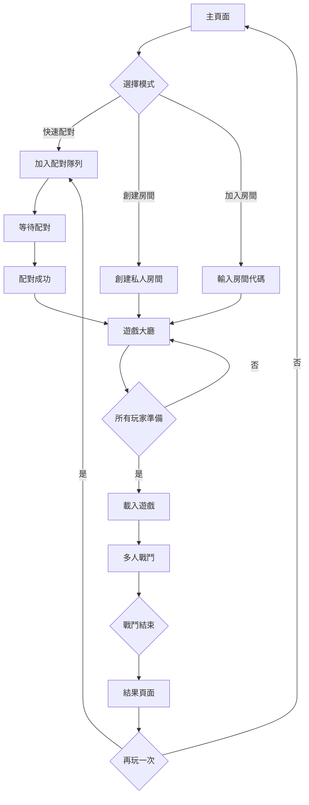
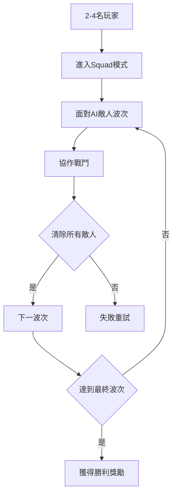
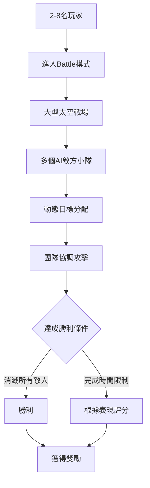

# Space Pirates 多人遊戲產品需求文檔

## 1. 產品概述
將現有的單人Space Pirates遊戲轉變為支援多人PvE合作的線上遊戲。玩家可以組隊進行太空戰鬥，共同對抗AI敵人，體驗協作戰鬥的樂趣。

- **目標用戶**：喜歡太空射擊遊戲和合作遊戲的玩家
- **核心價值**：提供流暢的多人太空戰鬥體驗，保持原有單人模式的完整性
- **市場定位**：休閒到中等核心度的多人合作遊戲

## 2. 核心功能

### 2.1 用戶角色
| 角色 | 註冊方式 | 核心權限 |
|------|----------|----------|
| 訪客玩家 | 無需註冊 | 可以遊玩單人模式，加入多人遊戲但無進度保存 |
| 註冊玩家 | 郵箱註冊 | 可以保存遊戲進度，查看統計數據，參與排行榜 |
| VIP玩家 | 付費升級 | 優先配對，專屬遊戲模式，詳細統計分析 |

### 2.2 功能模組
多人Space Pirates包含以下主要頁面：
1. **主頁面**：遊戲模式選擇，快速配對，登入/註冊入口
2. **配對頁面**：等待配對，配對進度，取消配對
3. **遊戲大廳**：房間設置，玩家列表，準備狀態
4. **多人遊戲頁面**：戰鬥畫面，隊友狀態，共享HUD
5. **結果頁面**：戰鬥統計，個人表現，隊伍成就

### 2.3 頁面詳情
| 頁面名稱 | 模組名稱 | 功能描述 |
|----------|----------|----------|
| 主頁面 | 遊戲模式選擇 | 顯示單人模式、多人Squad、多人Battle選項 |
| 主頁面 | 快速配對按鈕 | 一鍵開始配對，自動選擇最適合的遊戲模式 |
| 主頁面 | 玩家狀態 | 顯示當前登入狀態，等級，統計數據摘要 |
| 配對頁面 | 配對進度條 | 顯示當前排隊位置和預計等待時間 |
| 配對頁面 | 取消按鈕 | 允許玩家取消當前配對 |
| 配對頁面 | 匹配成功提示 | 顯示找到隊友和進入房間的動畫 |
| 遊戲大廳 | 房間設置 | 允許房主調整遊戲參數，難度，最大玩家數 |
| 遊戲大廳 | 玩家列表 | 顯示所有房間內玩家，準備狀態，等級 |
| 遊戲大廳 | 聊天功能 | 基本的文字聊天，預設快捷語句 |
| 多人遊戲頁面 | 共享戰鬥畫面 | 與單人模式相同的Babylon.js 3D渲染 |
| 多人遊戲頁面 | 隊友狀態面板 | 顯示隊友生命值，位置，主要武器狀態 |
| 多人遊戲頁面 | 共享目標系統 | 標記共享敵人，顯示隊友目標 |
| 結果頁面 | 個人統計 | 擊殺數，準確率，承受傷害，輸出傷害 |
| 結果頁面 | 隊伍成就 | 總擊殺數，完成時間，特殊成就 |
| 結果頁面 | 再玩一次 | 快速重新配對或返回房間的選項 |

## 3. 核心流程

### 3.1 多人遊戲流程

### 3.2 Squad PvE模式流程

### 3.3 Battle PvE模式流程

## 4. 用戶介面設計

### 4.1 設計風格
- **主色調**: 保持現有的太空主題深色背景
- **強調色**: 橙色 (#FF6B35) 用於重要按鈕和提示
- **輔助色**: 藍色 (#4A90E2) 用於隊友相關元素
- **字體**: 使用現有的未來科技感字體
- **按鈕**: 保持現有的3D立體風格
- **佈局**: 卡片式設計，保持與現有UI一致

### 4.2 頁面設計概覽
| 頁面名稱 | 模組名稱 | UI元素 |
|----------|----------|----------|
| 主頁面 | 遊戲模式選擇 | 三個並排的3D卡片，每個模式有獨特圖標和簡短描述 |
| 主頁面 | 快速配對按鈕 | 大型的橙色3D按鈕，帶有脈衝動畫效果 |
| 配對頁面 | 配對進度條 | 太空主題的進度條，帶有流動的星塵效果 |
| 遊戲大廳 | 玩家列表 | 頭像圓形顯示，準備狀態用綠色勾號標記 |
| 多人遊戲 | 隊友狀態 | 半透明HUD面板，顯示在畫面右側，不干擾主視野 |
| 結果頁面 | 統計展示 | 太空船控制面板風格的數據展示 |

### 4.3 響應式設計
- **桌面優先**: 主要針對桌面電腦優化
- **移動適配**: 支援平板電腦，但手機僅提供基本功能
- **觸控優化**: 支援觸控操作的虛擬搖桿和按鈕

## 5. 技術需求

### 5.1 網路需求
- **最低延遲**: 100ms以下為佳，200ms為可接受上限
- **頻寬需求**: 每個玩家上行/下行各64kbps
- **斷線處理**: 5秒內斷線重連保持遊戲狀態

### 5.2 性能需求
- **幀率**: 保持60fps，最低30fps
- **載入時間**: 進入戰鬥不超過10秒
- **記憶體**: 瀏覽器端不超過2GB

### 5.3 兼容性需求
- **瀏覽器**: Chrome 90+, Firefox 88+, Safari 14+
- **WebGL**: 支援WebGL 2.0
- **WebSocket**: 支援原生WebSocket

## 6. 商業模式

### 6.1 免費功能
- 單人模式完整體驗
- 基礎多人PvE模式
- 基礎統計和成就

### 6.2 付費功能
- VIP優先配對
- 高級遊戲模式
- 詳細統計分析
- 自定義房間設置
- 專屬外觀和特效