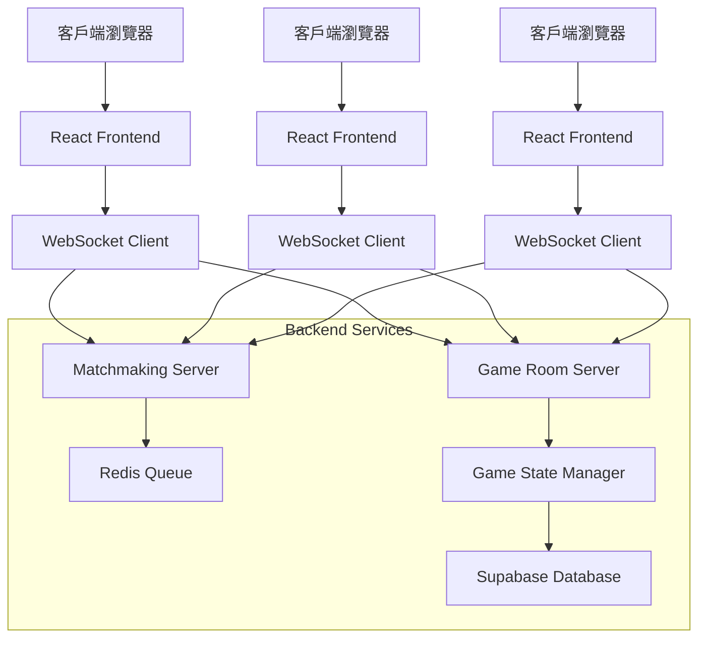
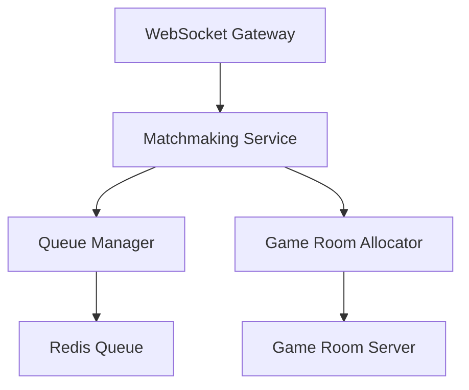
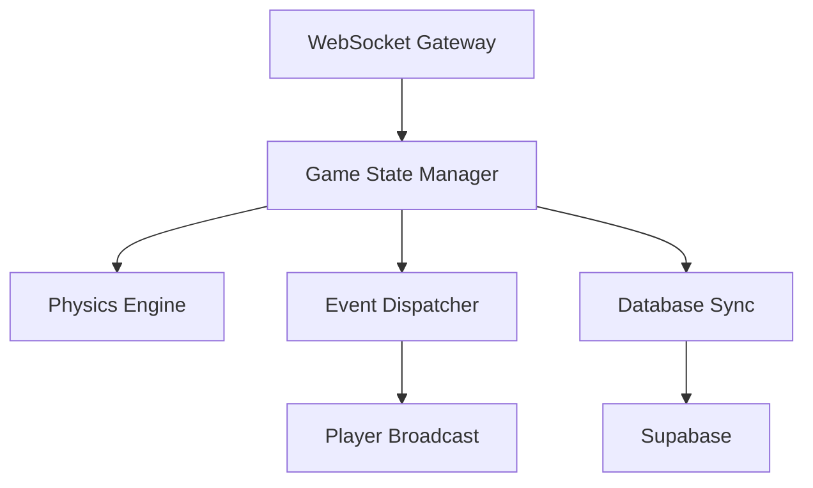
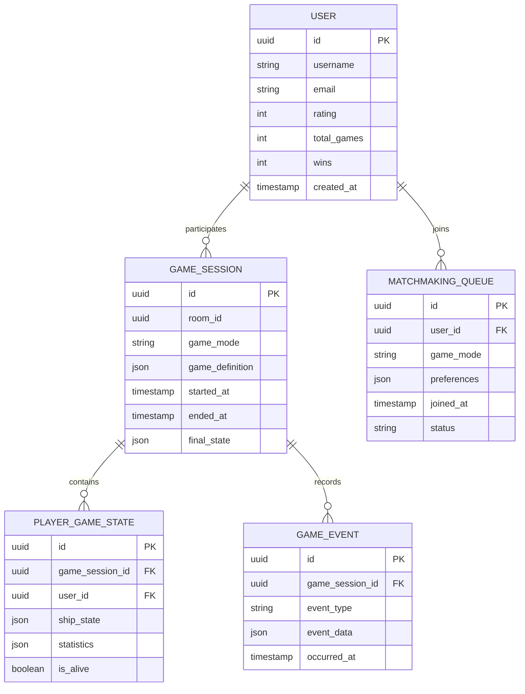

# Space Pirates 多人遊戲技術架構文檔

## 1. 架構設計

### 1.1 整體架構


### 1.2 技術選型
- **前端**: 保持現有的Babylon.js + TypeScript架構
- **後端**: Node.js + Express + WebSocket (Socket.io)
- **資料庫**: Supabase (PostgreSQL) 用於玩家資料和遊戲歷史
- **快取**: Redis 用於matchmaking隊列
- **認證**: Supabase Auth

## 2. 技術描述

### 2.1 前端技術
- **框架**: 現有的Babylon.js + TypeScript
- **網路**: Socket.io-client 用於WebSocket通訊
- **狀態管理**: 擴展現有的State系統支援多人模式

### 2.2 後端技術
- **框架**: Node.js + Express + Socket.io
- **資料庫**: Supabase (PostgreSQL)
- **快取**: Redis
- **認證**: Supabase Auth

### 2.3 初始化工具
- **後端**: npm init
- **前端**: 使用現有的vite配置

## 3. 路由定義

### 3.1 前端路由
| 路由 | 用途 |
|-------|---------|
| / | 主頁面，包含matchmaking介面 |
| /login | 登入頁面 |
| /lobby | 等待大廳 |
| /game | 遊戲房間 |
| /profile | 玩家檔案 |

### 3.2 後端API
| 路由 | 方法 | 用途 |
|-------|---------|---------|
| /api/auth/login | POST | 玩家登入 |
| /api/auth/register | POST | 玩家註冊 |
| /api/matchmaking/join | POST | 加入配對隊列 |
| /api/matchmaking/cancel | POST | 取消配對 |
| /api/game/create | POST | 創建遊戲房間 |
| /api/game/join | POST | 加入遊戲房間 |
| /api/game/leave | POST | 離開遊戲房間 |

## 4. 核心API定義

### 4.1 認證相關
```
POST /api/auth/login
```
請求:
```json
{
  "email": "player@example.com",
  "password": "password123"
}
```

響應:
```json
{
  "token": "jwt_token",
  "user": {
    "id": "uuid",
    "username": "player_name",
    "rating": 1500
  }
}
```

### 4.2 Matchmaking相關
```
POST /api/matchmaking/join
```
請求:
```json
{
  "gameMode": "squad_pve",
  "playerCount": 2,
  "difficulty": "normal"
}
```

響應:
```json
{
  "queueId": "queue_uuid",
  "estimatedWaitTime": 30,
  "positionInQueue": 5
}
```

## 5. 伺服器架構

### 5.1 Matchmaking Server


### 5.2 Game Room Server


## 6. 資料模型

### 6.1 實體關係圖


### 6.2 資料表定義

#### 用戶表 (users)
```sql
CREATE TABLE users (
    id UUID PRIMARY KEY DEFAULT gen_random_uuid(),
    username VARCHAR(50) UNIQUE NOT NULL,
    email VARCHAR(255) UNIQUE NOT NULL,
    password_hash VARCHAR(255) NOT NULL,
    rating INTEGER DEFAULT 1500,
    total_games INTEGER DEFAULT 0,
    wins INTEGER DEFAULT 0,
    created_at TIMESTAMP WITH TIME ZONE DEFAULT NOW(),
    updated_at TIMESTAMP WITH TIME ZONE DEFAULT NOW()
);

CREATE INDEX idx_users_rating ON users(rating DESC);
CREATE INDEX idx_users_username ON users(username);
```

#### 遊戲會話表 (game_sessions)
```sql
CREATE TABLE game_sessions (
    id UUID PRIMARY KEY DEFAULT gen_random_uuid(),
    room_id VARCHAR(100) UNIQUE NOT NULL,
    game_mode VARCHAR(50) NOT NULL,
    game_definition JSONB NOT NULL,
    started_at TIMESTAMP WITH TIME ZONE,
    ended_at TIMESTAMP WITH TIME ZONE,
    final_state JSONB,
    created_at TIMESTAMP WITH TIME ZONE DEFAULT NOW()
);

CREATE INDEX idx_game_sessions_room_id ON game_sessions(room_id);
CREATE INDEX idx_game_sessions_started_at ON game_sessions(started_at DESC);
```

#### 玩家遊戲狀態表 (player_game_states)
```sql
CREATE TABLE player_game_states (
    id UUID PRIMARY KEY DEFAULT gen_random_uuid(),
    game_session_id UUID REFERENCES game_sessions(id) ON DELETE CASCADE,
    user_id UUID REFERENCES users(id) ON DELETE CASCADE,
    ship_state JSONB NOT NULL,
    statistics JSONB NOT NULL,
    is_alive BOOLEAN DEFAULT true,
    created_at TIMESTAMP WITH TIME ZONE DEFAULT NOW(),
    UNIQUE(game_session_id, user_id)
);

CREATE INDEX idx_player_game_states_session_id ON player_game_states(game_session_id);
CREATE INDEX idx_player_game_states_user_id ON player_game_states(user_id);
```

## 7. 實現步驟

### 7.1 第一階段：基礎架構 (2週)
1. 設置Supabase專案和資料庫
2. 創建後端專案結構
3. 實現基本的WebSocket連接
4. 實現用戶認證系統

### 7.2 第二階段：Matchmaking系統 (2週)
1. 實現Redis隊列管理
2. 創建matchmaking邏輯
3. 實現遊戲房間分配
4. 添加配對狀態UI

### 7.3 第三階段：多人遊戲邏輯 (3週)
1. 修改現有的Game類支援網路同步
2. 實現遊戲狀態同步機制
3. 添加網路事件處理
4. 實現玩家輸入同步

### 7.4 第四階段：PvE模式整合 (2週)
1. 修改AI邏輯支援多人環境
2. 實現Squad模式的網路版本
3. 添加Battle模式的協作機制
4. 實現共享得分系統

### 7.5 第五階段：測試和優化 (1週)
1. 整合測試所有功能
2. 性能優化和bug修復
3. 添加監控和日誌
4. 部署準備

## 8. 最小改動策略

### 8.1 保持現有架構
- 保留Babylon.js渲染引擎
- 維持現有的State管理系統
- 重用現有的遊戲邏輯和物理引擎

### 8.2 增量修改
- 在現有的Game類中添加網路同步層
- 擴展GameDefinition支援多人配置
- 添加網路狀態管理但不改變核心遊戲邏輯

### 8.3 向後相容
- 保持單人模式功能完整
- 添加網路開關配置
- 支援離線遊戲模式

## 9. 風險評估

### 9.1 技術風險
- **網路延遲**：需要實現客戶端預測和伺服器權威
- **同步複雜性**：物理引擎同步可能會有挑戰
- **性能影響**：網路通訊可能影響遊戲性能

### 9.2 緩解措施
- 使用UDP協議降低延遲
- 實現增量狀態同步
- 添加網路品質檢測和自適應機制
- 提供本地伺服器選項

這個架構設計最小化了對現有程式碼的改動，同時提供了完整的多人遊戲功能。