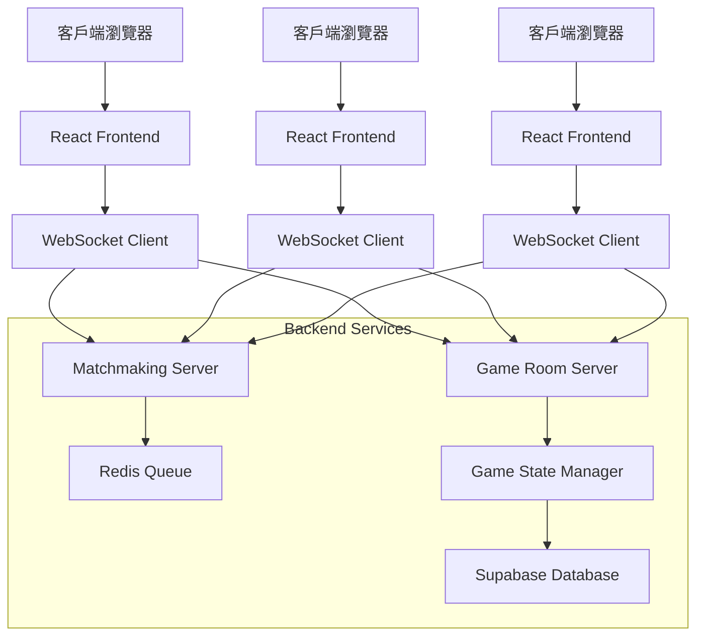
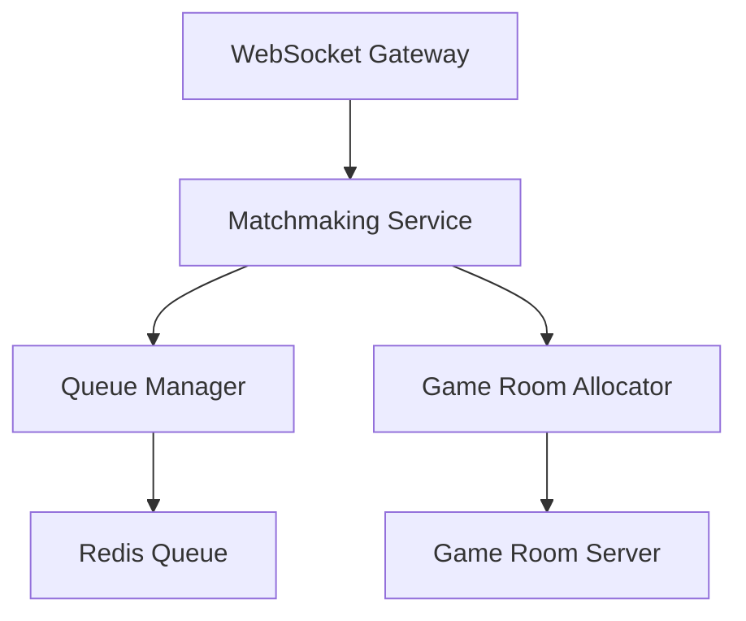
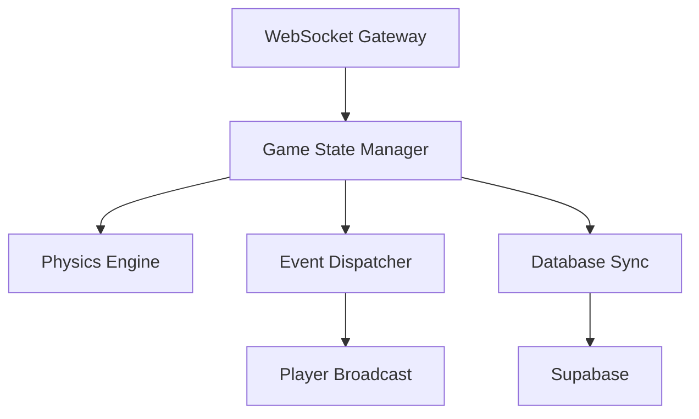
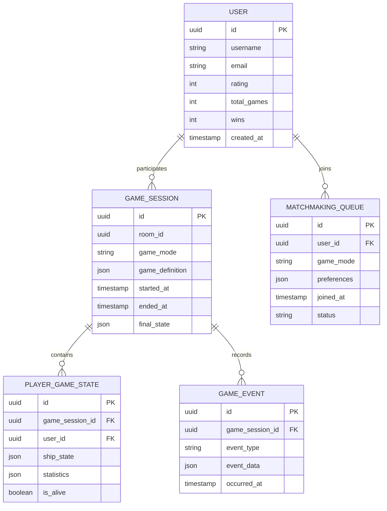

# Space Pirates 多人遊戲技術架構文檔

## 1. 架構設計

### 1.1 整體架構


### 1.2 技術選型
- **前端**: 保持現有的Babylon.js + TypeScript架構
- **後端**: Node.js + Express + WebSocket (Socket.io)
- **資料庫**: Supabase (PostgreSQL) 用於玩家資料和遊戲歷史
- **快取**: Redis 用於matchmaking隊列
- **認證**: Supabase Auth

## 2. 技術描述

### 2.1 前端技術
- **框架**: 現有的Babylon.js + TypeScript
- **網路**: Socket.io-client 用於WebSocket通訊
- **狀態管理**: 擴展現有的State系統支援多人模式

### 2.2 後端技術
- **框架**: Node.js + Express + Socket.io
- **資料庫**: Supabase (PostgreSQL)
- **快取**: Redis
- **認證**: Supabase Auth

### 2.3 初始化工具
- **後端**: npm init
- **前端**: 使用現有的vite配置

## 3. 路由定義

### 3.1 前端路由
| 路由 | 用途 |
|-------|---------|
| / | 主頁面，包含matchmaking介面 |
| /login | 登入頁面 |
| /lobby | 等待大廳 |
| /game | 遊戲房間 |
| /profile | 玩家檔案 |

### 3.2 後端API
| 路由 | 方法 | 用途 |
|-------|---------|---------|
| /api/auth/login | POST | 玩家登入 |
| /api/auth/register | POST | 玩家註冊 |
| /api/matchmaking/join | POST | 加入配對隊列 |
| /api/matchmaking/cancel | POST | 取消配對 |
| /api/game/create | POST | 創建遊戲房間 |
| /api/game/join | POST | 加入遊戲房間 |
| /api/game/leave | POST | 離開遊戲房間 |

## 4. 核心API定義

### 4.1 認證相關
```
POST /api/auth/login
```
請求:
```json
{
  "email": "player@example.com",
  "password": "password123"
}
```

響應:
```json
{
  "token": "jwt_token",
  "user": {
    "id": "uuid",
    "username": "player_name",
    "rating": 1500
  }
}
```

### 4.2 Matchmaking相關
```
POST /api/matchmaking/join
```
請求:
```json
{
  "gameMode": "squad_pve",
  "playerCount": 2,
  "difficulty": "normal"
}
```

響應:
```json
{
  "queueId": "queue_uuid",
  "estimatedWaitTime": 30,
  "positionInQueue": 5
}
```

## 5. 伺服器架構

### 5.1 Matchmaking Server


### 5.2 Game Room Server


## 6. 資料模型

### 6.1 實體關係圖


### 6.2 資料表定義

#### 用戶表 (users)
```sql
CREATE TABLE users (
    id UUID PRIMARY KEY DEFAULT gen_random_uuid(),
    username VARCHAR(50) UNIQUE NOT NULL,
    email VARCHAR(255) UNIQUE NOT NULL,
    password_hash VARCHAR(255) NOT NULL,
    rating INTEGER DEFAULT 1500,
    total_games INTEGER DEFAULT 0,
    wins INTEGER DEFAULT 0,
    created_at TIMESTAMP WITH TIME ZONE DEFAULT NOW(),
    updated_at TIMESTAMP WITH TIME ZONE DEFAULT NOW()
);

CREATE INDEX idx_users_rating ON users(rating DESC);
CREATE INDEX idx_users_username ON users(username);
```

#### 遊戲會話表 (game_sessions)
```sql
CREATE TABLE game_sessions (
    id UUID PRIMARY KEY DEFAULT gen_random_uuid(),
    room_id VARCHAR(100) UNIQUE NOT NULL,
    game_mode VARCHAR(50) NOT NULL,
    game_definition JSONB NOT NULL,
    started_at TIMESTAMP WITH TIME ZONE,
    ended_at TIMESTAMP WITH TIME ZONE,
    final_state JSONB,
    created_at TIMESTAMP WITH TIME ZONE DEFAULT NOW()
);

CREATE INDEX idx_game_sessions_room_id ON game_sessions(room_id);
CREATE INDEX idx_game_sessions_started_at ON game_sessions(started_at DESC);
```

#### 玩家遊戲狀態表 (player_game_states)
```sql
CREATE TABLE player_game_states (
    id UUID PRIMARY KEY DEFAULT gen_random_uuid(),
    game_session_id UUID REFERENCES game_sessions(id) ON DELETE CASCADE,
    user_id UUID REFERENCES users(id) ON DELETE CASCADE,
    ship_state JSONB NOT NULL,
    statistics JSONB NOT NULL,
    is_alive BOOLEAN DEFAULT true,
    created_at TIMESTAMP WITH TIME ZONE DEFAULT NOW(),
    UNIQUE(game_session_id, user_id)
);

CREATE INDEX idx_player_game_states_session_id ON player_game_states(game_session_id);
CREATE INDEX idx_player_game_states_user_id ON player_game_states(user_id);
```

## 7. 實現步驟

### 7.1 第一階段：基礎架構 (2週)
1. 設置Supabase專案和資料庫
2. 創建後端專案結構
3. 實現基本的WebSocket連接
4. 實現用戶認證系統

### 7.2 第二階段：Matchmaking系統 (2週)
1. 實現Redis隊列管理
2. 創建matchmaking邏輯
3. 實現遊戲房間分配
4. 添加配對狀態UI

### 7.3 第三階段：多人遊戲邏輯 (3週)
1. 修改現有的Game類支援網路同步
2. 實現遊戲狀態同步機制
3. 添加網路事件處理
4. 實現玩家輸入同步

### 7.4 第四階段：PvE模式整合 (2週)
1. 修改AI邏輯支援多人環境
2. 實現Squad模式的網路版本
3. 添加Battle模式的協作機制
4. 實現共享得分系統

### 7.5 第五階段：測試和優化 (1週)
1. 整合測試所有功能
2. 性能優化和bug修復
3. 添加監控和日誌
4. 部署準備

## 8. 最小改動策略

### 8.1 保持現有架構
- 保留Babylon.js渲染引擎
- 維持現有的State管理系統
- 重用現有的遊戲邏輯和物理引擎

### 8.2 增量修改
- 在現有的Game類中添加網路同步層
- 擴展GameDefinition支援多人配置
- 添加網路狀態管理但不改變核心遊戲邏輯

### 8.3 向後相容
- 保持單人模式功能完整
- 添加網路開關配置
- 支援離線遊戲模式

## 9. 風險評估

### 9.1 技術風險
- **網路延遲**：需要實現客戶端預測和伺服器權威
- **同步複雜性**：物理引擎同步可能會有挑戰
- **性能影響**：網路通訊可能影響遊戲性能

### 9.2 緩解措施
- 使用UDP協議降低延遲
- 實現增量狀態同步
- 添加網路品質檢測和自適應機制
- 提供本地伺服器選項

這個架構設計最小化了對現有程式碼的改動，同時提供了完整的多人遊戲功能。

## 10. 前端服務介面契約（VIVERSE 對接）

### 10.1 AuthService
- `initClient(config: { clientId: string; domain: string; cookieDomain?: string }): void`
- `checkAuth(): Promise<{ access_token: string; account_id: string; expires_in: number; state?: string } | undefined>`
- `getToken(): Promise<string | undefined>`
- `getDisplayName(token?: string): Promise<string>`（登入→Avatar `name`；未登入→`guest`）
- `isGuest(): Promise<boolean>`

### 10.2 AvatarService
- `init(token?: string): void`
- `getProfile(): Promise<{ name: string; activeAvatar: { headIconUrl: string; vrmUrl?: string } | null }>`
- `getActiveAvatar(): Promise<{ headIconUrl: string; vrmUrl: string }>`
- `getPublicAvatarList(): Promise<Avatar[]>`
- `getAvatarFileWithSDK(url: string): Promise<ArrayBuffer>`
- `getHeadIconUrlOrDefault(profile?: Profile): string`（未登入或無頭像→返回預設）

### 10.3 PlayService
- `init(): void`
- `newMatchmakingClient(appId: string, debug?: boolean): Promise<MatchmakingClient>`
- `setActor(actor: { session_id: string; name: string; properties: Record<string, number | string> }): Promise<{ success: boolean; message?: string }>`
- `createRoom(cfg: { name: string; mode: 'team'; maxPlayers: number; minPlayers: number; properties?: Record<string, any> }): Promise<CreateRoomResult>`
- `joinRoom(roomId: string): Promise<JoinRoomResult>`
- `leaveRoom(): Promise<{ success: boolean; message?: string }>`
- `closeRoom(): Promise<{ success: boolean; message?: string }>`
- `getAvailableRooms(): Promise<{ success: boolean; rooms: Room[] }>`
- `getMyRoomActors(): Promise<{ success: boolean; actors: Actor[] }>`
- 事件（若SDK提供）：`on(event: 'roomUpdated' | 'actorJoined' | 'actorLeft' | 'readyStateChanged', handler)`

### 10.4 UI 資料模型
- `UserProfile`: `{ name: string; headIconUrl: string; activeAvatar?: Avatar | null }`（未登入時 `name = 'guest'`、`headIconUrl = default`）
- `Actor`: `{ session_id: string; name: string; properties: Record<string, number | string> }`
- `Room`: `{ id: string; app_id: string; mode: 'team'; name: string; actors: Actor[]; max_players: number; min_players: number; is_closed: boolean; properties: Record<string, any>; master_client_id: string; game_session: string; created_by_me: boolean }`
- `PlayerUI`: `{ id: string; name: string; headIconUrl: string; ready: boolean; attributes: Record<string, number | string> }`

## 11. UI 元件規格（沿用現有設計風格）

### 11.1 AvatarBadge
- 屬性：`size: 'sm'|'md'|'lg'`、`src: string`、`fallbackSrc: string`、`ring: 'none'|'thin'|'glow'`
- 事件：`onClick()`
- 狀態：`loading`、`error`、`guest`
- 規範：圓形邊框、內陰影與輕微外光暈；尺寸統一（`sm=40px`、`md=64px`、`lg=96px`）。

### 11.2 PlayerCard
- 屬性：`name: string`、`headIconUrl: string`、`ready: boolean`、`attributes: Record<string, number|string>`
- 事件：`onToggleReady(nextReady: boolean)`、`onSelect()`
- 狀態：`idle`、`updating`、`disabled`
- 規範：卡片式布局、圓形頭像、右上角準備狀態綠勾標記。

### 11.3 PlayerList
- 屬性：`players: PlayerCardProps[]`
- 事件：`onPlayerAction(playerId, action)`
- 狀態：`empty`、`populated`
- 規範：自動換行栅格；加入/離開過渡動畫≤200ms。

### 11.4 ReadyToggle
- 屬性：`ready: boolean`、`disabled: boolean`
- 事件：`onChange(nextReady: boolean)`
- 狀態：`toggling`、`error`
- 規範：與現有3D按鈕一致；切換時提供明確回饋。

### 11.5 RoomHeader
- 屬性：`room: { id; name; mode; maxPlayers; minPlayers; isClosed; properties }`
- 事件：`onEditProperties(changes)`（房主）
- 狀態：`loading`、`ready`
- 規範：標題、模式徽章、玩家數、公開狀態。

### 11.6 RoomControls
- 屬性：`isMasterClient: boolean`、`allReady: boolean`
- 事件：`onStartGame()`（房主）`onCloseRoom()`（房主）`onLeaveRoom()`
- 狀態：`disabled`（非房主）
- 規範：主操作採橙色主按鈕；非房主禁用與提示。

### 11.7 QueuePanel
- 屬性：`status: 'idle'|'queueing'|'matched'|'error'`、`estimatedWaitTime?: number`、`positionInQueue?: number`
- 事件：`onCancelQueue()`
- 狀態：`updating`、`timeout`
- 規範：星塵進度條、數值展示；成功時彈性動畫提示。

### 11.8 ModeCard（遠端雙人）
- 屬性：`title`、`description`、`icon`
- 事件：`onSelect(mode)`
- 規範：沿用現有模式卡片樣式與圖標語言。

### 11.9 StatusBar（主頁/配對）
- 屬性：`auth: { isGuest: boolean; name: string; headIconUrl: string }`
- 規範：與主頁玩家狀態一致（需求文件 3.2/4.2 規範）。

### 11.10 RoomJoinForm
- 屬性：`value: string`、`error?: string`
- 事件：`onSubmit(roomId)`、`onChange(value)`
- 規範：格式檢查、Enter提交、錯誤提示非侵入式。

## 12. 實作計畫

1. 服務層封裝：建立 `AuthService`、`AvatarService`、`PlayService`，統一初始化、錯誤處理、快取與回退（guest）。
2. 主頁整合：於主頁狀態列加入 `StatusBar`（圓形頭像與名稱），快速配對入口沿用既有 `menuButton.svg` 樣式。
3. 配對頁：實作 `QueuePanel` 與 `RoomJoinForm`；打通 `newMatchmakingClient`、`setActor`、`createRoom`/`joinRoom`/`leaveRoom` 流程；錯誤與超時回饋。
4. 大廳頁：`RoomHeader`、`PlayerList`、`ReadyToggle`、`RoomControls`；整合 `getMyRoomActors()` 與房主權限操作（開始/關閉）。
5. NetSync：沿用本地雙人玩法，加入輸入驅動與狀態增量同步；客戶端預測與房主權威修正；斷線重連恢復。
6. 頭像一致性：提供預設(default)頭像資源；所有 2D 場景圓形顯示（40/64/96 尺寸）。

## 13. 驗證方法

- 本地 Stub 測試：
  - `checkAuth()` 返回 `undefined` 或假憑證；`getProfile()` 返回假名稱與頭像；`newMatchmakingClient()` 回傳假房與演員列表。
  - 以環境旗標 `USE_SDK_STUBS=true` 啟用；接口與行為與真 SDK 對齊。
- 端到端（viverse.com）：
  - 登入檢查（無重導）、建立/加入房間、準備機制、開始遊戲、結果頁、再玩一次。
  - 邊界：憑證失效、房間滿員、斷線重連、超時取消。
- 視覺/互動驗證：
  - 尺寸、色彩、動效（≤200ms、ease-out）符合規格；圓形頭像與 guest 覆蓋完整。

## 14. 測試用例（核心）

- 主頁：guest 與登入顯示一致；快速配對按鈕動效與禁用態正確。
- 配對：`createRoom`/`joinRoom` 成功與錯誤回饋；進度與隊列資訊準確；取消恢復狀態。
- 大廳：加入/離開動畫；準備勾切換；房主開始遊戲權限；房主離開處理。
- 戰鬥：雙人同步穩定；HUD 更新平滑；斷線重連可恢復。
- 結果：統計面板與再玩一次流暢。

## 15. 效能與網路監測

- FPS：目標 60fps（最低 30fps）；於調試面板顯示。
- 延遲：目標 ≤100ms（可接受 ≤200ms）；抖動時調整同步頻率。
- 重連：≤5s 完成；記錄重連次數與時長。

## 16. 交付物

- 更新後的技術架構文檔（本章節）；服務層設計與接口說明。
- 本地 `sdk-stubs` 使用指南；viverse.com E2E 測試清單與報告模板。
